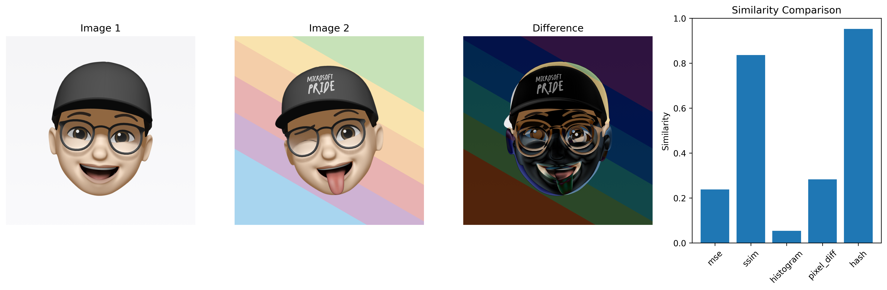

> [!NOTE]
> This code was generated by GitHub Copilot Agent mode using Claude Sonnet 4\
> For testing purposes only. Please review the code before using it in production.

# Image Difference Calculator

A comprehensive Python tool for calculating similarity between two images using multiple algorithms. This project provides both command-line and interactive interfaces for comparing images with detailed analysis and visualization capabilities.

## Features

🖼️ **Multiple Comparison Methods**
- **MSE (Mean Squared Error)** - Pixel-level difference calculation
- **SSIM (Structural Similarity Index)** - Structural and perceptual similarity
- **Histogram Comparison** - Color distribution analysis
- **Pixel Difference** - Threshold-based pixel counting
- **Perceptual Hash** - Content-based fingerprinting

📊 **Visualization**
- Side-by-side image comparison
- Difference highlighting
- Similarity metrics chart
- High-quality PNG output

🔧 **Flexible Interfaces**
- Command-line tool for batch processing
- Interactive mode for exploratory analysis
- Python API for integration

✅ **Robust Testing**
- 53 comprehensive tests
- Unit and integration test coverage
- Performance and stress testing
- Automated test runner

## Installation

### Prerequisites
- Python 3.7 or higher
- pip package manager

### Install Dependencies

```bash
pip install -r requirements.txt
```

The project requires:
- `opencv-python>=4.5.0` - Image processing
- `numpy>=1.21.0` - Numerical computations
- `matplotlib>=3.5.0` - Visualization
- `pytest>=7.0.0` - Testing framework (optional)
- `coverage>=6.0.0` - Test coverage analysis (optional)

## Quick Start

### Command Line Usage

**Basic comparison using MSE method:**
```bash
python image_diff_calculator.py image1.jpg image2.jpg
```

**Compare using all methods:**
```bash
python image_diff_calculator.py image1.jpg image2.jpg --method all
```

**Generate visualization:**
```bash
python image_diff_calculator.py image1.jpg image2.jpg --visualize --output comparison.png
```

**Use specific method:**
```bash
python image_diff_calculator.py image1.jpg image2.jpg --method ssim
```

### Interactive Mode

```bash
python interactive.py
```

The interactive mode provides:
- 🎯 **Similarity Summary**: Average similarity across all methods
- 📊 **Detailed Results**: Method-specific explanations
- 🖼️ **Visual Comparison**: Side-by-side image display
- 📈 **Progress Indicators**: Real-time calculation status

#### Example Output

```text
------------------------------------------------------------
📈 Similarity Overview:
------------------------------------------------------------
Method          Similarity   Detail Value    Description
------------------------------------------------------------
MSE             23.80%       3202.3206       Smaller is more similar
SSIM            83.62%       0.8362          Larger is more similar
Histogram       5.39%        0.0539          Larger is more similar
Pixel Diff      28.32%       0.7168          Smaller is more similar
Perceptual Hash 95.31%       0.0469          Smaller is more similar

------------------------------------------------------------
📋 Detailed Results:
------------------------------------------------------------

🔹 MSE (MSE)
   Similarity: 23.80%
   MSE Value: 3202.32
   Explanation: Mean Squared Error, smaller value indicates more similar images

🔹 SSIM (SSIM)
   Similarity: 83.62%
   SSIM Value: 0.8362
   Explanation: Structural Similarity Index, range [0,1], larger value indicates more similar images

🔹 Histogram (HISTOGRAM)
   Similarity: 5.39%
   Histogram Correlation: 0.0539
   Explanation: Color distribution similarity, range [0,1], larger value indicates more similar images

🔹 Pixel Diff (PIXEL_DIFF)
   Similarity: 28.32%
   Pixel Difference Ratio: 71.68%
   Explanation: Proportion of different pixels, smaller value indicates more similar images

🔹 Perceptual Hash (HASH)
   Similarity: 95.31%
   Hash Distance: 0.0469
   Explanation: Perceptual hash Hamming distance, range [0,1], smaller value indicates more similar images

🎯 Similarity Summary                                          🎯
------------------------------------------------------------
Average Similarity: 47.29%
Similarity Level: Low 🔴
```



### Python API Usage

```python
from image_diff_calculator import ImageDiffCalculator

calculator = ImageDiffCalculator()

# Calculate similarity using MSE
result = calculator.calculate_diff_ratio('image1.jpg', 'image2.jpg', 'mse')
print(f"Similarity: {result['similarity_ratio']:.4f}")

# Generate visualization
calculator.save_diff_visualization('image1.jpg', 'image2.jpg', 'output.png')
```

## Comparison Methods Explained

### 1. MSE (Mean Squared Error)
- **Range**: 0 to ∞ (lower is more similar)
- **Best for**: Detecting pixel-level changes
- **Use case**: Quality assessment, exact matching

### 2. SSIM (Structural Similarity Index)
- **Range**: -1 to 1 (higher is more similar)
- **Best for**: Perceptual similarity assessment
- **Use case**: Image quality evaluation, human visual perception

### 3. Histogram Comparison
- **Range**: 0 to 1 (higher is more similar)
- **Best for**: Color distribution analysis
- **Use case**: Content similarity, color matching

### 4. Pixel Difference
- **Range**: 0 to 1 (lower is more similar)
- **Best for**: Change detection with customizable sensitivity
- **Use case**: Monitoring, difference highlighting

### 5. Perceptual Hash
- **Range**: 0 to 1 (lower is more similar)
- **Best for**: Content-based similarity regardless of minor changes
- **Use case**: Duplicate detection, content matching

## Testing

The project includes a comprehensive test suite with 53 tests covering:

### Running Tests

**Run all tests:**
```bash
cd tests
python run_tests.py
```

**Run specific test types:**
```bash
python run_tests.py --unit          # Unit tests only
python run_tests.py --integration   # Integration tests only
python run_tests.py --check         # Check test environment
```

**Run with coverage report:**
```bash
python run_tests.py --coverage
```

**Run specific test:**
```bash
python run_tests.py --test TestImageDiffCalculator.test_calculate_mse_identical_images
```

### Test Categories

1. **Unit Tests (32 tests)**
   - Core functionality validation
   - Edge case handling
   - Error condition testing
   - Input validation

2. **Integration Tests (21 tests)**
   - Command-line interface testing
   - Interactive mode validation
   - End-to-end workflow verification
   - Performance and stress testing

### Test Coverage

The test suite covers:
- ✅ All comparison methods
- ✅ Image loading and preprocessing
- ✅ Error handling and edge cases
- ✅ Command-line argument parsing
- ✅ Interactive user input validation
- ✅ Visualization generation
- ✅ Performance characteristics

## File Structure

```
image-diff-calculator/
├── image_diff_calculator.py    # Main calculation engine
├── interactive.py              # Interactive interface
├── requirements.txt            # Project dependencies
├── pytest.ini                 # Test configuration
├── README.md                   # This documentation
├── LICENSE                     # License information
├── example/                    # Example images and outputs
│   ├── image1.png
│   ├── image2.png
│   └── diff_visualization.png
└── tests/                      # Comprehensive test suite
    ├── run_tests.py           # Test runner script
    ├── test_image_diff_calculator.py  # Unit tests
    ├── test_integration.py    # Integration tests
    ├── create_test_images.py  # Test image generation
    └── test_images/           # Generated test images
        ├── red_100x100.png
        ├── blue_100x100.png
        ├── gradient_100x100.png
        └── ...
```

## Advanced Usage

### Batch Processing

```python
import os
from image_diff_calculator import ImageDiffCalculator

calculator = ImageDiffCalculator()
image_dir = "path/to/images"
reference_image = "reference.jpg"

results = []
for filename in os.listdir(image_dir):
    if filename.endswith(('.jpg', '.png')):
        image_path = os.path.join(image_dir, filename)
        result = calculator.calculate_diff_ratio(reference_image, image_path, 'ssim')
        results.append({
            'filename': filename,
            'similarity': result['similarity_ratio']
        })

# Sort by similarity
results.sort(key=lambda x: x['similarity'], reverse=True)
```

### Custom Threshold for Pixel Difference

```python
# Adjust sensitivity for pixel difference method
result = calculator.calculate_diff_ratio('img1.jpg', 'img2.jpg', 'pixel_diff')
# Default threshold is 30

# For more sensitive detection, modify the calculator method:
# calculator.calculate_pixel_diff_ratio(img1, img2, threshold=10)
```

### Performance Optimization

For large images or batch processing:
- Images are automatically resized to the smaller dimension
- Consider preprocessing images to a consistent size
- Use MSE or hash methods for faster computation
- SSIM provides best quality but is computationally intensive

## Troubleshooting

### Common Issues

**ImportError: No module named 'cv2'**
```bash
pip install opencv-python
```

**Memory issues with large images**
- Images are automatically resized, but very large images may still cause issues
- Consider pre-processing images to a reasonable size (e.g., 1024x1024)

**Matplotlib display issues**
- The tool works headlessly and saves visualizations to files
- No display server required for command-line usage

**Path issues on Windows**
- Use forward slashes or raw strings: `r"C:\path\to\image.jpg"`
- The interactive mode handles path formatting automatically

### Getting Help

Run with `--help` for command-line options:
```bash
python image_diff_calculator.py --help
```

Check test environment:
```bash
cd tests
python run_tests.py --check
```

## Contributing

1. Fork the repository
2. Create a feature branch
3. Add tests for new functionality
4. Ensure all tests pass: `python tests/run_tests.py`
5. Submit a pull request

### Development Setup

```bash
# Clone repository
git clone <repository-url>
cd image-diff-calculator

# Install dependencies
pip install -r requirements.txt

# Run tests
cd tests
python run_tests.py

# Check test coverage
python run_tests.py --coverage
```

## License

This project is licensed under the MIT License - see the [LICENSE](LICENSE) file for details.

## Acknowledgments

- OpenCV community for image processing capabilities
- scikit-image for SSIM implementation inspiration
- NumPy for efficient numerical computations
- Matplotlib for visualization tools

## Performance Benchmarks

Typical performance on modern hardware:
- **MSE**: ~0.001s per comparison (100x100 images)
- **SSIM**: ~0.005s per comparison (100x100 images) 
- **Histogram**: ~0.002s per comparison (100x100 images)
- **Pixel Diff**: ~0.001s per comparison (100x100 images)
- **Hash**: ~0.001s per comparison (100x100 images)

Performance scales roughly with image area, but automatic resizing helps maintain reasonable computation times.

---

> [!NOTE]
> This project is for research and testing. Please review results before production use.